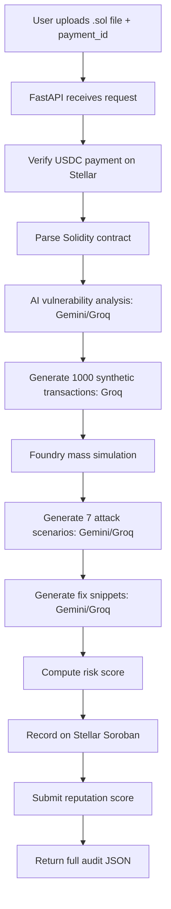
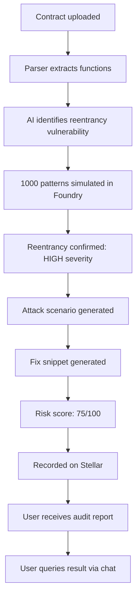

# ChainMind - PRD (Product Requirement Document)

## 1. Product Overview

**Name:** ChainMind

**Type:** Autonomous AI Smart Contract Security Auditor

**Platform:** FastAPI Python Backend + Stellar Blockchain + Soroban Smart Contracts + Multi-AI Engine

**Objective:**
Enable developers, DeFi protocols, and security teams to automatically audit Solidity smart contracts through an AI-powered pipeline, with on-chain verified audit trails, reputation scoring, and economic agency via USDC payments on Stellar.

**Target Users:**

* Solidity developers
* DeFi protocol teams
* Smart contract auditors
* Web3 security researchers
* DAO treasuries
* Cryptocurrency exchanges

---

## 2. Features

### 2.1 User Features

* Upload Solidity (`.sol`) files for automated audit
* Receive AI-generated vulnerability analysis with severity scoring
* Get synthetic transaction pattern simulations (1000+ patterns)
* View Foundry-based on-chain simulation results
* Receive AI-generated fix snippets for each vulnerability
* Query audit results in natural language

### 2.2 AI Agent Features

* Multi-model AI fallback architecture (Gemini → Groq)
* Context-aware vulnerability detection
* Automated attack scenario generation (7 scenarios per audit)
* Risk score computation (0–100, severity-weighted)
* Natural-language Q&A powered by Mistral Large

### 2.3 Blockchain Features

* On-chain audit trail via Stellar Soroban (SimulationRegistry)
* Automated reputation scoring on Stellar (AgentReputationRegistry)
* USDC payment verification for economic agency
* Agent identity registration on-chain
* ZK-proof agent verification via SelfClaw

---

## 3. Technical Architecture

### Components

#### FastAPI Backend

Provides REST API endpoints:

* File upload
* Simulation pipeline orchestration
* Result caching
* Natural language querying
* Agent stats retrieval

#### AI Engine

Provides intelligence through:

* Gemini 2.0 Flash (primary vulnerability analysis)
* Groq Llama-3.3-70b (fallback + transaction generation)
* Mistral Large (natural-language Q&A)

#### Solidity Parser

Handles:

* Regex-based contract structure extraction
* Function signature parsing
* State variable identification
* Contract summary generation

#### Foundry Simulation Engine

Handles:

* Contract compilation via Forge
* Mass simulation with synthetic transactions
* PASS/FAIL result parsing
* Vulnerability confirmation

#### Soroban Smart Contracts

Handles:

* Simulation registry (audit trail)
* Payment gateway (USDC fees)
* Agent identity registry
* Agent reputation registry

#### Stellar Blockchain

Provides:

* Settlement layer
* USDC transfers
* Immutable audit trail storage

#### In-Memory Cache

Stores:

* Simulation results (UUID-keyed)
* Agent earnings data
* Session state

---

### Flow



---

### Example Audit Flow



---

## 4. Tech Stack

### Frontend

* REST API Client
* cURL / Postman / Custom UI

### Backend

* Python 3.10+
* FastAPI
* Uvicorn

### AI Models

* Gemini 2.0 Flash (Google Generative AI)
* Groq Llama-3.3-70b
* Mistral Large

### Database

* In-memory (session-based)
* Stellar Soroban (on-chain persistence)

### Blockchain

* Stellar Network (Testnet / Mainnet)
* Soroban Smart Contracts

### Smart Contract Language

* Rust
* soroban-sdk

### Simulation Engine

* Foundry (Forge)

### Wallet Integration

* stellar-sdk

### AI Orchestration

* google-generativeai
* groq
* mistralai

---

## 5. Local Development Setup

### Prerequisites

* Python >= 3.10
* Foundry (Forge)
* Stellar Testnet account
* Gemini API key
* Groq API key
* Mistral API key

### Installation

```bash
git clone https://github.com/your-org/ChainMind-Backend.git
cd ChainMind-Backend/backend
python -m venv venv
source venv/bin/activate
pip install -r requirements.txt
```

### Environment Configuration

Create a `.env` file in the backend directory:

```env
STELLAR_RPC_URL=https://rpc-testnet.stellar.org:443
STELLAR_NETWORK_PASSPHRASE=Testnet SDF Future Network 10
PRIVATE_KEY=<your_stellar_secret_key>
SIMULATION_REGISTRY_ID=C...
PAYMENT_GATEWAY_ID=C...
AGENT_IDENTITY_REGISTRY_ID=C...
AGENT_REPUTATION_REGISTRY_ID=C...
USDC_ISSUER=GBHNGN...
USDC_CONTRACT_ID=C...
GEMINI_API_KEY=your_gemini_api_key
GROQ_API_KEY=your_groq_api_key
MISTRAL_API_KEY=your_mistral_api_key
AGENT_NAME=ChainMind
AGENT_DESCRIPTION="Autonomous AI smart contract security auditor on Stellar"
```

### Running the Application

```bash
# Development
uvicorn main:app --reload --host 0.0.0.0 --port 8000

# Production
uvicorn main:app --host 0.0.0.0 --port 8000
```

---

## 6. MVP Scope

### Contract Upload

* `.sol` file upload endpoint
* Payment verification via Stellar USDC

### AI Audit Pipeline

* Vulnerability analysis (Gemini + Groq fallback)
* Synthetic transaction generation (1000 patterns)
* Foundry-based simulation
* Attack scenario generation (7 scenarios)
* Fix snippet generation

### Risk Scoring

* Severity-weighted scoring
* 0–100 risk scale
* CRITICAL / HIGH / MEDIUM / LOW / INFO levels

### On-Chain Recording

* Simulation result hash on Soroban
* Reputation score submission
* Agent identity registration

### Query Interface

* Natural-language Q&A about audit results
* Agent stats endpoint

---

## 7. Future Enhancements

### AI Features

* Multi-contract batch audits
* Upgradeable contract analysis
* Gas optimization suggestions
* Formal verification integration

### Blockchain Expansion

* EVM chain support (Ethereum, Polygon, BSC)
* Cross-chain audit trail
* Automated exploit PoC generation
* Slither/Mythril integration

### Platform Features

* Web dashboard with audit history
* Scheduled recurring audits
* Webhook notifications
* Team collaboration

### Economic Features

* Subscription-based pricing
* Audit credit system
* Referral rewards
* Agent staking

### Asset Support

* Multi-token payment options
* fiat on/off ramps
* Cross-chain USDC

---

## 8. Security & Compliance

### Security

* Payment verification before audit execution
* Secure private key management
* Sandboxed Foundry simulation environment
* Input validation on uploaded contracts
* No database of user data (in-memory only)

### Production Hardening

When deploying wallet-connected code in production:

* Disable core dumps with `ulimit -c 0`
* Never log `secret` values or private keys
* Use environment-specific API keys
* Implement rate limiting on `/api/simulate`
* Add authentication middleware
* Use background task queue for long-running audits

### Compliance

* Agent identity registration on-chain
* Immutable audit trail for transparency
* Verifiable reputation history
* Open-source audit methodology

---

## 9. Performance Considerations

* Cache simulation results in-memory (UUID lookup)
* AI model fallback prevents single-provider downtime
* Foundry timeout capped at 60 seconds
* Asynchronous processing for long simulations

### Target Metrics

* Contract parsing < 1 second
* AI vulnerability analysis < 15 seconds
* Foundry simulation < 60 seconds
* Full pipeline < 120 seconds
* Support concurrent audit requests

---

## 10. Testing Plan

### Backend Testing

* Unit tests for API endpoints
* Contract parser tests
* Risk scoring logic tests

### AI Engine Testing

* Vulnerability detection accuracy tests
* Fallback routing tests (Gemini → Groq)
* Attack scenario quality tests

### Simulation Testing

* Foundry integration tests
* Synthetic transaction generation tests
* PASS/FAIL result parsing tests

### Integration Testing

Full workflow:

Contract Upload

↓

Payment Verification

↓

AI Vulnerability Analysis

↓

Synthetic Transaction Generation

↓

Foundry Simulation

↓

Attack Scenario Generation

↓

Fix Generation

↓

Risk Scoring

↓

On-Chain Recording

↓

Result Return

### Load Testing

* Concurrent audit requests
* AI API rate limit handling
* Large contract file processing

---

## 11. Deployment Plan

### Backend

Deploy on:

* AWS (ECS / EC2)
* DigitalOcean App Platform
* Railway
* Render

### AI Models

* Google Generative AI API
* Groq API
* Mistral API

### Blockchain

* Stellar Testnet (Development)
* Stellar Mainnet (Production)

### Smart Contracts

Deploy Soroban contracts:

* Testnet
* Mainnet

### Monitoring

* Application Logs
* AI API Usage Monitoring
* Stellar Transaction Monitoring
* Error Tracking (Sentry)
* Audit Success/Fail Metrics

---

## 12. Success Metrics

### User Metrics

* Total audits performed
* Active users
* Repeat audit rate

### Quality Metrics

* Vulnerability detection accuracy
* False positive rate
* Fix snippet acceptance rate
* Average risk score distribution

### Financial Metrics

* Total audit fees collected
* Agent earnings on Stellar
* Payment success rate

### Platform Metrics

* Pipeline completion rate
* Average audit duration
* AI fallback trigger rate
* On-chain recording success rate

---

## 13. Core API Commands

### Audit

POST /api/simulate

### Query

POST /api/query

### Retrieval

GET /api/simulation/{id}

### Agent Stats

GET /api/agent/stats

### Health

GET /
